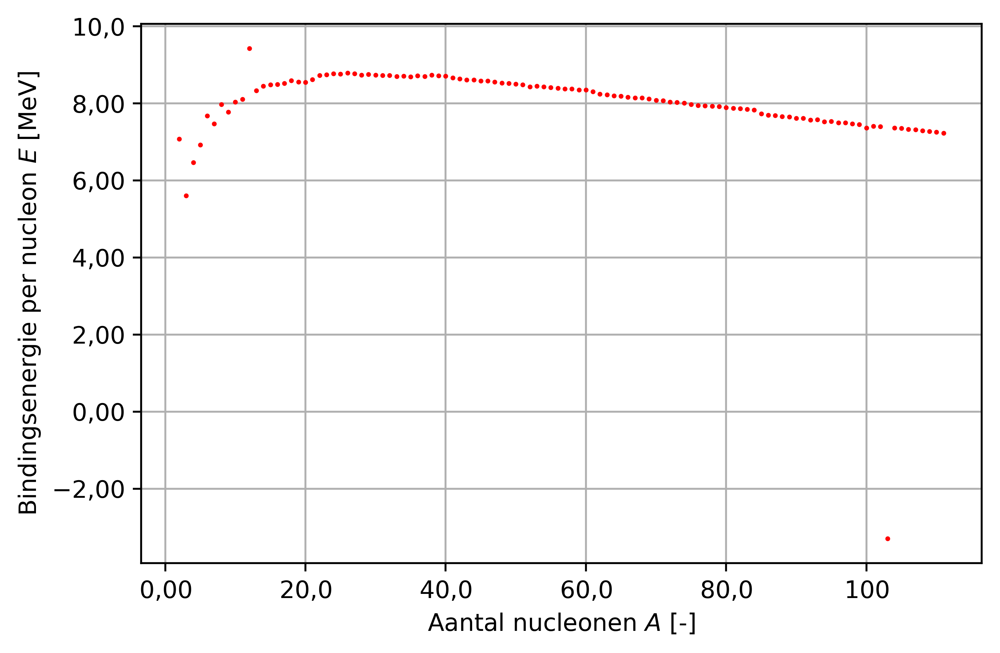

# Python Cursus 1e-jaars 07-05-2018

Dit is de Python code welke gebruikt is bij de Python cursus op 07-05-2018.
De deeltjesfysica code is [hier](deeltjesfysica\deeltjesfysica.ipynb) in de vorm van een Jupyter Notebook te vinden. De voorbeelden zijn [hier](voorbeelden\voorbeelden.ipynb) in de vorm van een Jupyter Notebook te vinden.
De overige bestanden en mappen dienen als werkomgeving.

## Doel
Het doel van de cursus is om te begrijpen hoe het volgende figuur tot stand komt.

Tot slot zullen er voorbeelden behandeld worden voor het gebruik van Python in de opleiding.